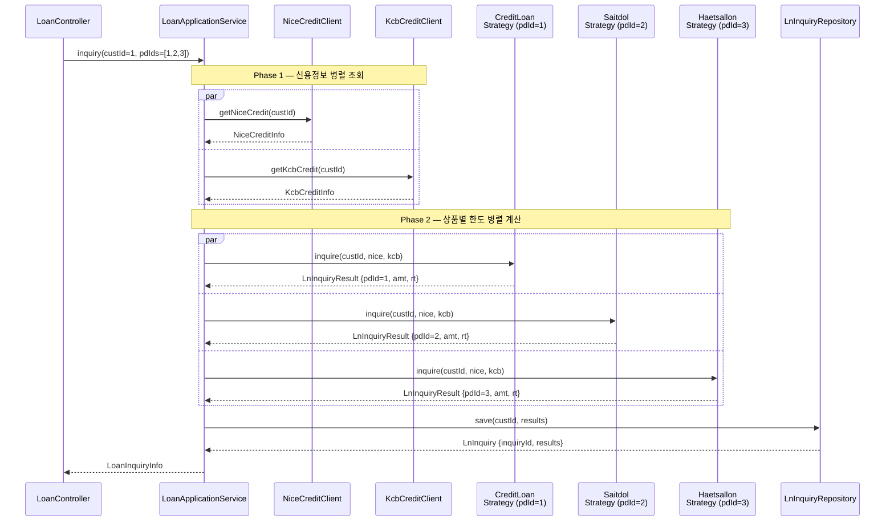

# 대출 한도조회 서비스 흐름

## 업무 흐름

```
대출 신청 → 시스템 심사 → 한도조회
```

고객이 상품을 선택해 대출을 신청하면, 시스템이 신용정보기관(NICE, KCB)을 통해 심사를 수행하고 상품별 한도와 금리를 반환한다. 개인/기업 모두 동일한 흐름을 따른다.

- **대출 신청**: 고객이 조회할 상품 목록(`pdIds`)을 선택해 요청
- **시스템 심사**: NICE, KCB 신용정보 병렬 조회 (Phase 1)
- **한도조회**: 심사 결과를 바탕으로 상품별 한도·금리 계산 후 반환 (Phase 2)

---

## 요청/응답

```
POST /v1/loans/inquiry
{ "custId": 1, "pdIds": [1, 2, 3] }

200 OK
{
  "inquiryId": 1,
  "custId": 1,
  "inquiryDt": "2026-05-06",
  "results": [
    { "pdId": 1, "maxLoanAmt": 50000000, "intrRt": 0.045 },
    { "pdId": 2, "maxLoanAmt": 30000000, "intrRt": 0.055 },
    { "pdId": 3, "maxLoanAmt": 10000000, "intrRt": 0.075 }
  ]
}
```

## 시퀀스 다이어그램



## 구조 설명

두 단계 병렬 구조다.

- **Phase 1 (시스템 심사)**: NICE, KCB 신용정보를 동시에 조회한다. 두 결과가 모두 필요하므로 `allOf().join()`으로 대기한다.
- **Phase 2 (한도 계산)**: 심사 결과를 각 상품 전략에 넘겨 상품별 한도·금리를 동시에 계산한다. 상품 수만큼 `CompletableFuture`가 생성된다.

Phase 1이 완료돼야 Phase 2가 시작되므로 두 단계는 순차적으로 이어지고, 각 단계 내부는 병렬이다.

## 상품별 전략

| pdId | Strategy | 한도 결정 기준 |
|------|----------|---------------|
| 1 | `CreditLoanInquiryStrategy` | NICE + KCB 평균 신용점수 |
| 2 | `SaitdolInquiryStrategy` | SGI 보증 정보 |
| 3 | `HaetsallonInquiryStrategy` | KIFA 보증 정보 |
