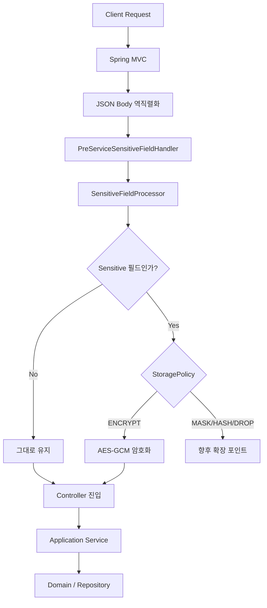
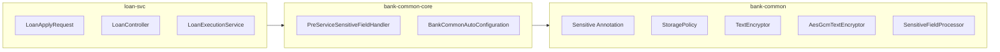
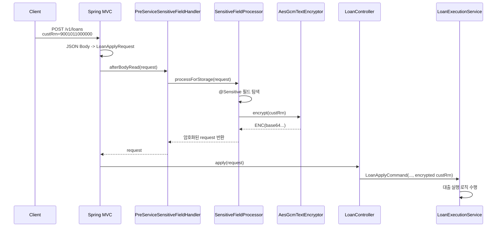
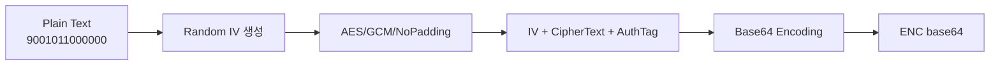
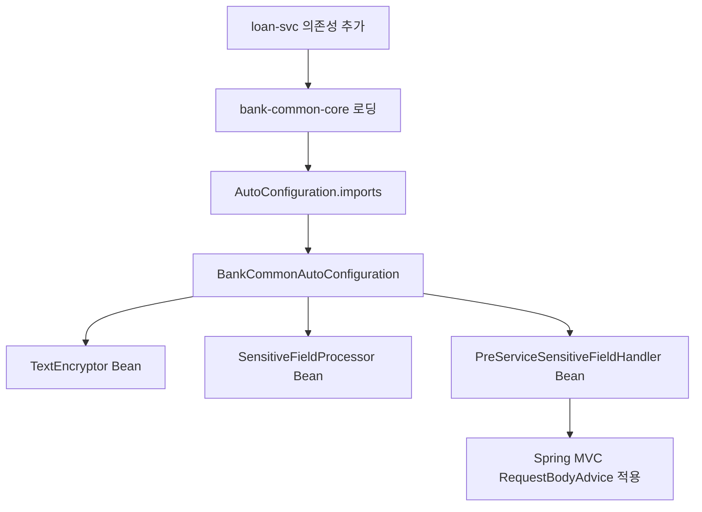
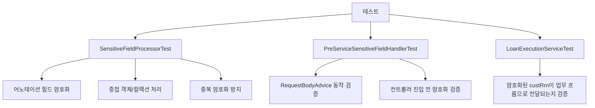
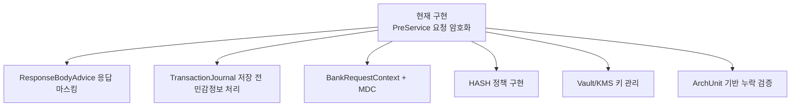

# PreService 민감정보 암호화 공통 기능

## 1. 목적

이 기능은 Spring MVC 요청 처리 흐름에서 컨트롤러 호출 전에 요청 DTO의 민감정보 필드를 암호화하는 공통 전처리 기능이다.

업무 서비스가 실행되기 전에 요청 DTO의 민감정보 필드를 자동으로 탐지하고 암호화한다. 개별 컨트롤러나 서비스에서 암호화 코드를 직접 작성하지 않고, 필드에 정책만 선언하면 공통 모듈이 처리한다.

```java
@Sensitive(storagePolicy = StoragePolicy.ENCRYPT)
private String custRrn;
```

기능 목표는 다음과 같다.

- 민감정보 암호화 로직을 업무 코드에서 분리한다.
- 필드 단위 어노테이션으로 민감정보 처리 정책을 선언한다.
- 요청 DTO가 컨트롤러에 전달되기 전에 암호화를 완료한다.
- 공통 모듈 의존성 추가만으로 여러 업무 서비스에 동일한 처리를 적용한다.

---

## 2. 전체 처리 흐름



---

## 3. 모듈 구성

현재 구현은 Spring 비의존 모듈과 Spring 연동 모듈로 분리했다.



### 모듈 역할

| 모듈 | 역할 |
|---|---|
| `bank-common` | Spring 비의존 순수 Java 모듈. 민감정보 어노테이션, 정책, 암호화, 필드 처리 로직 제공 |
| `bank-common-core` | Spring MVC 연동 모듈. `RequestBodyAdvice`, AutoConfiguration 제공 |
| `loan-svc` | 업무 서비스. `bank-common-core` 의존성 추가 후 `@Sensitive` 사용 |

---

## 4. 요청 처리 시퀀스



---

## 5. 적용 예시

### 5.1 요청 DTO

```java
@Getter
@Schema(description = "대출 실행 요청")
public class LoanApplyRequest {

    @NotNull
    private Long inquiryId;

    @NotNull
    private Long pdId;

    @NotNull
    @Positive
    private BigDecimal lnAmt;

    @NotBlank
    @Sensitive(storagePolicy = StoragePolicy.ENCRYPT)
    @Schema(description = "고객 주민등록번호", example = "9001011000000")
    private String custRrn;
}
```

### 5.2 Controller

```java
@PostMapping
public LoanApplyResponse apply(@Valid @RequestBody LoanApplyRequest request) {
    LoanApplyInfo info = loanExecutionService.apply(
            new LoanApplyCommand(
                    request.getInquiryId(),
                    request.getPdId(),
                    request.getLnAmt(),
                    request.getCustRrn()
            )
    );

    return toResponse(info);
}
```

컨트롤러가 받는 `request.getCustRrn()` 값은 이미 원문이 아니라 암호문이다.

```text
9001011000000
↓
ENC(base64...)
```

### 5.3 Service

```java
LnArr lnArr = loanRepository.save(new LnArrCreateSpec(
        inquiry.getCustId(),
        result.getPdId(),
        command.getLnAmt(),
        result.getIntrRt(),
        today,
        today.plusYears(1),
        command.getCustRrn()
));
```

서비스는 암호화 알고리즘을 알 필요 없이 이미 처리된 값을 그대로 사용한다.

---

## 6. 핵심 구현

### 6.1 `@Sensitive`

```java
@Target(ElementType.FIELD)
@Retention(RetentionPolicy.RUNTIME)
public @interface Sensitive {

    StoragePolicy storagePolicy() default StoragePolicy.MASK;
}
```

필드 단위로 민감정보 처리 정책을 선언한다.

### 6.2 `StoragePolicy`

```java
public enum StoragePolicy {
    PLAIN,    // 원문 유지: "홍길동" -> "홍길동"
    MASK,     // 마스킹: "01012345678" -> "010****5678"
    ENCRYPT,  // 암호화: "9001011000000" -> "ENC(q83b...)"
    HASH,     // 해시: "9001011000000" -> "HASH(4f8c2a9e...)"
    DROP      // 저장 제외: "123456" -> null 또는 저장 대상 제외
}
```

현재는 `ENCRYPT`를 구현했다. 나머지는 향후 거래저널 저장, 응답 마스킹, 해시 저장 정책으로 확장 가능하다.

| 정책 | 처리 예시 | 구현 상태 |
|---|---|---|
| `PLAIN` | `"홍길동"` -> `"홍길동"` | 확장 예정 |
| `MASK` | `"01012345678"` -> `"010****5678"` | 확장 예정 |
| `ENCRYPT` | `"9001011000000"` -> `"ENC(q83b...)"` | 구현 완료 |
| `HASH` | `"9001011000000"` -> `"HASH(4f8c2a9e...)"` | 확장 예정 |
| `DROP` | `"123456"` -> `null` 또는 저장 대상 제외 | 확장 예정 |

### 6.3 `PreServiceSensitiveFieldHandler`

```java
@ControllerAdvice
public class PreServiceSensitiveFieldHandler extends RequestBodyAdviceAdapter {

    private final SensitiveFieldProcessor sensitiveFieldProcessor;

    @Override
    public boolean supports(MethodParameter methodParameter, Type targetType,
                            Class<? extends HttpMessageConverter<?>> converterType) {
        return true;
    }

    @Override
    public Object afterBodyRead(Object body, HttpInputMessage inputMessage,
                                MethodParameter parameter, Type targetType,
                                Class<? extends HttpMessageConverter<?>> converterType) {
        return sensitiveFieldProcessor.processForStorage(body);
    }
}
```

`HandlerInterceptor`가 아니라 `RequestBodyAdvice`를 사용한 이유는 다음과 같다.

- `HandlerInterceptor#preHandle`은 컨트롤러 호출 전 실행된다.
- 하지만 JSON body가 DTO 객체로 변환된 필드 상태를 다루기에는 부적합하다.
- `RequestBodyAdvice.afterBodyRead`는 요청 body가 DTO로 역직렬화된 직후 실행된다.
- 따라서 필드 어노테이션 기반 암호화에 적합하다.

### 6.4 `SensitiveFieldProcessor`

`SensitiveFieldProcessor`는 리플렉션을 사용해 요청 객체의 필드를 순회한다.

처리 대상:

- 요청 DTO 자신
- 부모 클래스 필드
- 중첩 객체
- 배열
- `Iterable` 컬렉션 내부 객체

처리 제외 대상:

- `null`
- primitive
- enum
- `java.*` 단순 값 객체
- `jakarta.*` 타입
- `static` 필드
- `final` 필드

`@Sensitive(storagePolicy = ENCRYPT)` 필드를 발견하면 `TextEncryptor`를 사용해 값을 암호화한다.

---

## 7. 암호화 방식



사용 알고리즘:

```text
AES/GCM/NoPadding
```

AES-GCM을 선택한 이유:

- 대칭키 기반으로 빠르다.
- 검증된 표준 암호화 방식이다.
- GCM은 암호화와 변조 검증을 함께 제공한다.
- CBC 방식처럼 별도의 HMAC 조합을 직접 구현하지 않아도 된다.
- 같은 원문도 매번 다른 IV로 암호화되어 다른 암호문이 생성된다.

예시:

```text
9001011000000
↓
ENC(q83b...base64...)
```

이미 `ENC(...)` 형태인 값은 다시 암호화하지 않는다. 이는 중복 암호화를 방지하기 위한 처리다.

---

## 8. 자동 설정 구조



### 8.1 의존성 추가

```gradle
dependencies {
    implementation project(':bank-common-core')
}
```

### 8.2 AutoConfiguration

```java
@AutoConfiguration
public class BankCommonAutoConfiguration {

    @Bean
    @ConditionalOnMissingBean
    TextEncryptor textEncryptor(...) {
        return new AesGcmTextEncryptor(encryptionKey);
    }

    @Bean
    @ConditionalOnMissingBean
    SensitiveFieldProcessor sensitiveFieldProcessor(TextEncryptor textEncryptor) {
        return new SensitiveFieldProcessor(textEncryptor);
    }

    @Bean
    @ConditionalOnMissingBean
    PreServiceSensitiveFieldHandler preServiceSensitiveFieldHandler(
            SensitiveFieldProcessor sensitiveFieldProcessor) {
        return new PreServiceSensitiveFieldHandler(sensitiveFieldProcessor);
    }
}
```

### 8.3 AutoConfiguration 등록 파일

```text
META-INF/spring/org.springframework.boot.autoconfigure.AutoConfiguration.imports
```

```text
com.bank.common.core.autoconfigure.BankCommonAutoConfiguration
```

이 구조 덕분에 업무 서비스는 별도의 설정 클래스를 만들 필요 없이 `bank-common-core` 의존성만 추가하면 된다.

---

## 9. 테스트 전략



### 9.1 `SensitiveFieldProcessorTest`

순수 Java 단위 테스트다.

검증 내용:

- `@Sensitive(storagePolicy = ENCRYPT)` 필드가 암호화되는지
- 중첩 객체/컬렉션 내부 필드도 처리되는지
- 이미 `ENC(...)` 형태인 값은 다시 암호화하지 않는지

### 9.2 `PreServiceSensitiveFieldHandlerTest`

Spring MVC 요청 처리 지점 테스트다.

검증 내용:

- HTTP request body가 DTO로 변환된 뒤
- 컨트롤러 호출 전에
- `@Sensitive` 필드가 암호화되는지

### 9.3 `LoanExecutionServiceTest`

업무 흐름 테스트다.

검증 내용:

- 대출 실행 시 암호화된 주민등록번호가 `LoanApplyCommand`에서 `LnArrCreateSpec`까지 전달되는지

### 9.4 검증 명령

```bash
./gradlew :bank-common:test :bank-common-core:test :loan-core:test :loan-svc:test
./gradlew test
```

---

## 10. 설계 특징

### 10.1 컨트롤러 진입 전 처리

Spring MVC의 `RequestBodyAdvice`를 사용해 요청 body가 DTO로 변환된 직후 전처리를 수행한다.

```text
HTTP Request Body
↓
DTO 역직렬화
↓
RequestBodyAdvice.afterBodyRead
↓
Controller Method
```

이 위치에서 처리하면 컨트롤러와 서비스는 원문 민감정보를 직접 다루지 않고 암호화된 값을 받는다.

### 10.2 관심사 분리

업무 서비스는 암호화 알고리즘을 알 필요가 없다.

```java
@Sensitive(storagePolicy = StoragePolicy.ENCRYPT)
private String custRrn;
```

업무 코드는 정책만 선언한다. 공통 모듈은 탐지, 암호화, 중복 암호화 방지, Spring 연동을 담당한다.

### 10.3 확장 가능한 설계

현재는 `ENCRYPT`만 구현했지만, 구조상 다음 기능을 자연스럽게 추가할 수 있다.

```text
MASK  -> 응답 마스킹
HASH  -> 검색/비교용 해시 저장
DROP  -> 거래저널 저장 제외
PLAIN -> 예외적 원문 허용
```

### 10.4 자동 설정 기반 적용

공통 기능을 각 서비스에서 직접 Bean 등록하지 않도록 `AutoConfiguration.imports` 기반 자동 설정으로 제공했다.

서비스 모듈은 `bank-common-core` 의존성만 추가하면 기본 Bean 구성이 자동으로 적용된다.

### 10.5 테스트 가능한 컴포넌트 분리

Spring 비의존 로직과 Spring 연동 로직을 분리했다.

```text
SensitiveFieldProcessor -> 순수 단위 테스트 가능
PreServiceSensitiveFieldHandler -> Spring MVC 통합 지점 테스트 가능
LoanExecutionService -> 업무 흐름 검증 가능
```

---

## 11. 향후 확장 계획



확장 후보:

- `ResponseBodyAdvice` 기반 채널별 응답 마스킹
- 거래저널 저장 전 `MASK`, `DROP`, `HASH` 정책 적용
- `BankRequestContext`와 GUID 기반 요청 추적
- MDC 연동 로그 추적
- Vault/KMS 기반 키 관리
- `@Sensitive` 누락을 잡는 정적 아키텍처 테스트
- 복호화 책임 분리
- 필드별 암호화 키 alias 지원

---
